# JobQuest V2
## Full-Stack Modernization and Migration Case Study

*Incremental modernization of a production job-search application using Node.js, PostgreSQL, Vite, Render, Neon, GitHub Actions, Playwright, accessibility testing, and forward-only database migrations.*

---

## Table of contents

1. [Executive summary](#executive-summary)
2. [The original application (Before V2)](#the-original-application-before-v2)
3. [The V2 application (After V2)](#the-v2-application-after-v2)
4. [Before vs. After](#before-vs-after)
5. [Technology stack](#technology-stack)
6. [Project structure](#project-structure)
7. [The migration process — ten rounds](#the-migration-process--ten-rounds)
8. [Database migrations](#database-migrations)
9. [Testing strategy and CI/CD](#testing-strategy-and-cicd)
10. [Security](#security)
11. [Accessibility](#accessibility)
12. [Performance](#performance)
13. [Deployment architecture: Render + Neon](#deployment-architecture-render--neon)
14. [The final release: development → main](#the-final-release-development--main)
15. [Engineering decisions log](#engineering-decisions-log)
16. [Lessons learned](#lessons-learned)
17. [Screenshots](#screenshots)
18. [Portfolio summary](#portfolio-summary)
19. [Resume bullets](#resume-bullets)
20. [Interview talking points](#interview-talking-points)

---

## Executive summary

JobQuest is a secure, multi-user job-application tracker. It was not rewritten for V2 — it was **modernized incrementally, on top of a live production application**, through ten sequential, PR-gated rounds, each merged into a `development` integration branch, each verified by a real CI pipeline (GitHub Actions, real PostgreSQL, real Chromium) before the next round began.

The central engineering challenge of this project was not "build new features." It was: **modernize and expand an existing, working, already-deployed application while preserving its behavior, its security posture, and its deployment stability** — a constraint every round respected. Nothing in `render.yaml`'s service shape changed. The database's owner-scoped, session-based security model was extended, never replaced. No round was allowed to redesign a page that wasn't in scope, remove a working feature, or introduce infrastructure (a second database, a CDN, a cache layer, a framework migration) without evidence that it was actually needed.

What made this project unusual as a case study is the discipline applied *before* writing code: every round began with an audit of what already existed, because the original planning brief consistently assumed the codebase was less complete than it actually was. Three separate "gap-close" rounds (Checklist, Contacts/Networking, Import/Export) found that most of the requested functionality — sometimes 80–90% of it — was already built, tested, and working; the real engineering work was finding and closing the specific, narrow gap, not rebuilding what already worked. Two rounds (Tasks, Habits) required a genuine architectural judgment call: is this a new domain, or does it overlap with something that already exists? Both were resolved with an explicit, documented decision rather than an assumption.

By the end, the migration had:

- Introduced a Vite build step for a frontend that had *never had one* — without introducing React, without changing a single pixel of already-working UI, and without adding hot-module-reload complexity that risked the app's existing auth/cookie behavior.
- Shipped six substantial new feature areas (Dashboard/Applications workspace, Application Checklist, Contacts/Networking, Import/Export hardening, Task Management, Habit Tracker, Journal/Notes, Analytics) across four new database tables and one purely additive index migration.
- Closed real, previously-undiscovered security and accessibility defects along the way — a CSV formula-injection hole present in *every* CSV export, an unsafe-URL vector in `job_url`, a shared color-contrast violation on the app's toast notification component used on every single page, and a mobile navigation drawer race condition that could leave the app's scroll permanently locked on mobile.
- Closed with a formal, nine-phase final round (analytics + full release-hardening capstone) that re-audited the *entire* backlog from every prior round, ran a complete security/accessibility/performance audit, found and fixed four more real, previously-undiscovered bugs during full-suite CI validation, and produced a written `development → main` integration plan before any merge was authorized.
- Ended with `development` merged into `main` via a real, two-parent merge commit, all 8 CI gates green on the integrated branch, and a documented, honestly-flagged piece of pre-existing infrastructure debt (a Postgres worker-thread RPC race condition) deliberately *not* patched under release pressure — logged for a properly-scoped V2.1 fix instead.

Every claim in this document is grounded in this repository's own commit history, pull requests, migration files, feature-round documentation, and CI results — not reconstructed from memory or assumption.

---

## The original application (Before V2)

*Reconstructed directly from `CURRENT_STATE_AUDIT.md`, a read-only discovery snapshot written before any V2 work began.*

**Runtime & framework.** Plain Node.js 24 (`type: module`) on the backend — no framework, no Express/Fastify/Nest. Hand-rolled HTTP handling in `backend/src/server.js` (910 lines at baseline), with domain logic split across `service.js` (745 lines), `advanced.js` (1,576 lines), and `feature-upgrade.js` (794 lines). The frontend was vanilla HTML/CSS/JS — **no framework, no bundler, no TypeScript** — served as static files directly by the Node server: `frontend/app.js` (2,726 lines), `frontend/styles.css` (2,323 lines), plus five smaller modules (`application-table.js`, `application-preview.js`, `ui-utils.js`, `dashboard-config.js`, `icons.js`). There was no root-level or frontend `package.json` at all — the frontend shipped unbundled, syntax-checked with `node --check`. Confirmed absent from the entire codebase at baseline: React, shadcn/ui, Radix, Base UI, Tailwind, Framer Motion.

**Database.** Production PostgreSQL on **Neon**, accessed via `pg` (node-postgres) directly — **no ORM**. Migrations were hand-written, versioned SQL files in `backend/jobsearch/migrations/` (001 through 008 at baseline). SQLite existed only as a migration-source/backup format, explicitly never used as a runtime fallback in production. A recent hotfix (`481c00b`) had already hardened the connection layer against Neon's compute-suspend disconnects.

**Auth & authorization — already mature.** Custom session auth using opaque random tokens stored only as SHA-256 hashes, 12-hour expiry, HttpOnly/SameSite cookies (`Secure` in production). A 4-digit PIN login with salted scrypt hashing and a 5-attempt/5-minute lockout. CSRF tokens bound to session on every mutation. Two roles (`USER`, `MANAGER`), with the manager account seeded out-of-band via environment variables — never through public registration. Row-level ownership enforced at the query layer, returning 404 (not 403) on cross-user access to avoid leaking existence. This was, in the audit's own words, "a genuinely security-conscious design already."

**Hosting.** Render (`render.yaml`): a single `web` service, `rootDir: backend`, Node runtime, migrations run automatically via `preDeployCommand`, health check at `/api/health`. Neon was the sole database, in production and in local development. No containerization, no separate frontend host — one deployable unit.

**Testing & CI — already mature.** Node's built-in test runner for backend/frontend/integration/e2e logic, plus Playwright for real-browser functional, accessibility (axe-core), responsive, and visual-regression testing. GitHub Actions already ran five parallel jobs on every PR against real infrastructure — a real Postgres 17 service container, not mocks.

**Existing feature set.** Applications (CRUD, table + Kanban, stages, priorities, activity timeline, interviews, per-application contacts, resume-version field, notes), a widget-driven Dashboard, daily/weekly goals, follow-up tracking, networking, import, and a Manager dashboard for cross-user oversight. Dark/light theming and WCAG AA contrast fixes were already in place. **Explicitly absent**: no task manager, no habit tracker, no journal/notes system, no standalone contacts/CRM view, no analytics module — this was the genuinely new surface area the V2 revamp was meant to add.

**The central fork in the road.** The audit's own conclusion, verbatim in spirit: the original revamp brief was written assuming a React + shadcn/ui + Radix + Framer Motion single-page app with a heavyweight multi-agent documentation scaffold. The actual repository was a vanilla-JS, no-build, server-rendered-static-files application with a lightweight one-doc-per-round history and an already-mature CI/security/testing setup. Reconciling the brief's assumptions against the actual codebase — not blindly executing the brief — was the first and most consequential engineering decision of the entire project.

---

## The V2 application (After V2)

Ten rounds later, `main` now includes everything below, merged via a real two-parent commit (`4064502`).

**Dashboard.** An information hierarchy organized into three tiers — Immediate Actions, Pipeline, Context — instead of an undifferentiated widget grid. Quick filters (Applied Today/Week/Month, Recently Updated, Active/Closed) sit alongside the pre-existing 30-widget registry, date-range selector, and drill-through navigation.

**Applications.** Table and Kanban views, saved filter views, a rich per-column filter dialog (contains/equals/starts_with/ends_with/before/after/between), sort with deterministic secondary ordering, filter chips, XLSX/CSV/JSON export.

**Application Checklist.** Full CRUD — create, edit, delete, reorder (server-side adjacent-position swap) — plus read-time lifecycle-phase grouping, on top of the pre-existing schema and default-item generation.

**Contacts / Networking.** A real, working link between a networking contact and the application it belongs to (the pre-existing UI had the field to do this but never rendered it), an edit capability, and a live Networking panel on the application detail page.

**Import / Export.** CSV import (new), CSV formula-injection protection on every CSV export (closed a real, pre-existing security gap), `job_url` protocol validation, and a "View Rows" UI surfacing per-row import results that the backend had always recorded but nothing had ever displayed.

**Task Management.** A new, genuinely net-new `tasks` domain — Backlog/Today/Upcoming/Completed views, priority, optional due date, optional application linking, simple recurrence — deliberately built as its own table rather than overloading the pre-existing, date-mandatory `reminders` domain.

**Habit Tracker.** A new `habits`/`habit_logs` pair — daily/weekdays/weekly frequency, a unified boolean-and-count completion model, idempotent upsert-based progress writes, and derived (never stored) streaks.

**Journal / Notes.** A new `notes` table for general notes and daily journal entries, searchable, optionally linked to an application, with pinning — deliberately kept separate from the eight pre-existing embedded free-text fields scattered across the schema (`applications.notes`, `interviews.preparation_notes`, etc.), which stayed untouched.

**Analytics.** A dedicated Analytics page — pipeline funnel, response/interview/offer rates by source and by resume version, a configurable date range — built entirely on backend aggregation endpoints that mostly already existed, using the app's existing dependency-free SVG chart helpers. No charting library was added.

**Cross-cutting improvements.** A formal, final security audit (no unresolved CRITICAL/HIGH findings), a full accessibility remediation (the shared toast component's contrast violation fixed at the root, not excluded from scans; zero accessibility-scan exclusions remain anywhere in the E2E suite), a performance pass (one real missing index closed; a CDN, load balancer, Redis cache, and API response cache all evaluated and explicitly declined for lack of evidence), and a release process that produced a written integration plan before any merge into `main` was attempted.

---

## Before vs. After

| Area | Before V2 | After V2 | Engineering reason |
|---|---|---|---|
| Frontend build | No build step; five plain JS files served as-is, `node --check` for syntax validation only | Vite production build (`frontend/src/**` → `frontend/dist/**`), `vite build --watch` for local iteration | Enables ES-module code-splitting into feature folders without a framework migration; chosen over a Vite *dev server* specifically to avoid a second origin/CORS surface touching auth cookies |
| Frontend organization | One 2,726-line `app.js` plus five flat helper files | `app.js` (view rendering) + nine `features/<domain>/format.js` pure-logic modules (analytics, applications, checklist, contacts, dashboard, habits, import-export, notes, tasks) | Each new domain round extracted its own pure formatting/validation logic into a dedicated module rather than growing the monolith further |
| Backend organization | `server.js`, `service.js`, `advanced.js`, `feature-upgrade.js` | Same four files, plus three new domain modules: `tasks.js`, `habits.js`, `notes.js` | New net-new domains got their own handler module, following the existing pattern rather than inventing a new one |
| Database schema | 8 migrations, applications-centric plus goals/reminders/checklist/networking/import | 12 migrations — 4 new tables (`tasks`, `habits`, `habit_logs`, `notes`) + 1 index-only migration | Every new table backed a domain confirmed genuinely absent by direct search before it was built |
| Migrations | Hand-written, versioned, forward-only SQL, no ORM | Same model, unchanged | Preserved deliberately — see Engineering Decisions |
| Dashboard | 30-widget registry, drill-through, date range | Same, plus an explicit information-hierarchy (tiers) and Applications quick filters | The redesign only added what the audit confirmed was missing — most of the brief's ask already existed |
| Application tracking | CRUD, table + Kanban, stages, filters, saved views, export | Unchanged and preserved; checklist edit/delete/reorder added on top of an already-complete schema | Checklist schema and most backend logic pre-dated this round; only UI + two endpoints were the real gap |
| Networking/Contacts | CRUD existed; the application-link field silently never rendered | Same CRUD, with the link actually wired up, an edit UI, and a live application-detail panel | The "gap" was a broken connection between two already-built pieces, not missing CRUD |
| Tasks | Did not exist (closest analog: date-mandatory `reminders`) | New `tasks` table, four views, optional due date, optional recurrence | `reminders.due_date` is `NOT NULL` by schema; Tasks needed to represent undated backlog items, which `reminders` structurally cannot do without a breaking schema change |
| Habits | Did not exist | New `habits`/`habit_logs`, unified boolean+count model, derived streaks | Confirmed genuinely net-new by direct search; explicitly scoped away from four adjacent-looking domains (Goals, daily/weekly Goals, Tasks, Reminders) |
| Notes | 8 embedded free-text fields across 8 tables, no dedicated notes/journal concept | New `notes` table, general + daily-journal types, optional application link, pinning | Consolidating the 8 embedded fields was considered and explicitly rejected — too much blast radius on mature, tested domains for a cosmetic win |
| Analytics | Several backend aggregation endpoints existed with no dedicated page; one endpoint (`funnel`) was dead code | One new `resume` analytics kind, one new Analytics page reusing existing chart helpers | Closed the one real gap (resume performance had no JSON view) instead of building an analytics layer from scratch |
| Import/Export | JSON + structured-text import, mature preview/duplicate/transaction pipeline; XLSX export already had formula-injection protection; CSV export did not | CSV import added; formula-injection protection extended to every CSV export; `job_url` protocol validated | The CSV export gap was a real, exploitable security hole present since the export feature existed — found and closed |
| Testing | `node --test` + Playwright (functional, a11y, responsive, visual regression), real Postgres in CI | Same infrastructure, every round adds coverage on top of it — test counts grew from 9 (Round 2) to 44 (final round) frontend/unit tests alone | "What already exists — preserve, don't rebuild" was the explicit, written testing philosophy from Round 2 onward |
| Accessibility | WCAG AA contrast fixes already landed pre-V2 | A shared, every-page component's color-contrast bug fixed at the root; zero scan exclusions remain anywhere in the suite | The final round's explicit mandate was to fix the root cause, not extend the prior round's exclusion |
| Security | Mature session/CSRF/ownership model, dedicated `security.js` and CI job | Same model extended (never replaced) to 3 new domains; CSV formula-injection and unsafe-URL holes closed; formal final authorization matrix produced | "Extend it for new tables, don't replace it" — an explicit standing rule from `AGENTS.md` |
| CI/CD | 5 parallel GitHub Actions jobs, real Postgres, real Chromium, on every PR | Same 5-job structure retained and extended (frontend build/audit steps added); every round's PR ran the full matrix before merge | No new CI framework was introduced — the existing pipeline was already mature |
| Deployment | Render, single web service, Neon-only database, migrations via `preDeployCommand` | Unchanged service shape; one `buildCommand` line added (`&& npm run build:frontend`) to account for the Vite step | "Protected infrastructure" — Render/Neon service shape never changed without an explicit, approved proposal |

---

## Technology stack

### Frontend

- HTML, CSS, **vanilla JavaScript** — no framework
- **Vite** (`^8.3.0`) as a production build tool, introduced in Round 2
- Native ES modules, no TypeScript
- Feature-scoped pure-logic modules under `frontend/src/features/<domain>/format.js`

React (with shadcn/ui, Radix, and Framer Motion) was the stack the original revamp brief assumed. It was **deliberately not adopted** — logged explicitly in `brain/DECISIONS.md`: the real codebase was a mature, no-build vanilla-JS app with strong existing CI/test/security coverage, and a full framework migration would have been a ground-up rewrite carrying real risk to a working production app, directly conflicting with the project's own "preserve all working behavior" constraint. A build step delivers the maintainability win (ES modules instead of one 2,726-line file) without that risk. The React path is kept as a documented option in the PRD's history, not pursued.

### Backend

- Node.js 24 (`type: module`), no framework
- Raw SQL via `pg` (node-postgres) — no ORM (no Prisma, Drizzle, or Knex)
- `exceljs` for XLSX export

### Database

- PostgreSQL, hosted on **Neon**
- Hand-written, versioned, **forward-only** SQL migrations (`backend/jobsearch/migrations/001`–`012`)
- SQLite retained solely as a migration-source/backup format — never a runtime fallback

### Testing

- Node's built-in test runner (`node --test`) for backend, frontend-logic, integration, and e2e suites
- **Playwright** (`@playwright/test`) for real-browser functional, responsive, and visual-regression testing across five configured viewports (`desktop`, `compact-desktop`, `tablet`, `mobile`, `small-mobile`)
- **`@axe-core/playwright`** for accessibility scanning
- Real PostgreSQL 17 (via a service container in CI, or a throwaway Docker container locally) for every integration/e2e/migration test — never mocked

### Infrastructure

- GitHub + **GitHub Actions** (five parallel CI jobs: static-quality, tests, security, sqlite→postgres migration, browser-and-visual)
- **Render** — single web service, Node runtime, automatic migrations on deploy
- **Neon** — the sole database, in production and local development

### Development / AI tooling

| Tool | Status | Evidence |
|---|---|---|
| **Claude Code (Claude Sonnet 5)** | **Used** — the tool that implemented every round of this migration | Every commit across the entire V2 history carries a `Co-Authored-By: Claude Sonnet 5 <noreply@anthropic.com>` trailer; `AGENTS.md` is written as its (and other agents') operating manual for this repo |
| **OpenAI Codex** | **Planned/drafted, not used for implementation** | `Feature_Upgrade_2_Codex_Prompt.md` is an untracked planning-draft prompt written *for* Codex; Round 3's own implementation doc notes this draft "was written without full knowledge of this codebase" and the actual round deviated substantially from it — implementation itself was carried out via Claude Code |
| **Headroom** (local context-compression layer) | **Installed, not activated** | `HEADROOM.md`, dated 2026-08-06: "Nothing is wrapped yet" |
| Google Antigravity, Gemini-based agents | **Referenced generically, not evidenced as used** | `AGENTS.md` is written to be agent-agnostic ("Claude Code, OpenAI Codex, Google Antigravity, Gemini-based agents, or otherwise") — no commit history or artifact indicates any of these actually touched this codebase |

---

## Project structure

```text
JobQuest1.0/
├── .github/
│   └── workflows/
│       └── ci.yml                     # 5-job pipeline: static-quality, tests, security,
│                                       #   sqlite-postgres-migration, browser-and-visual
├── backend/
│   ├── jobsearch/
│   │   └── migrations/                # 001_jobsearch.sql … 012_final_performance_indexes.sql
│   ├── src/
│   │   ├── server.js                  # hand-rolled HTTP handling, routing, static serving
│   │   ├── service.js                 # applications core logic
│   │   ├── advanced.js                # analytics, exports, aging/stage reports
│   │   ├── feature-upgrade.js         # dashboard, filters, saved views
│   │   ├── tasks.js                   # Round 7 — net-new
│   │   ├── habits.js                  # Round 8 — net-new
│   │   ├── notes.js                   # Round 9 — net-new
│   │   ├── db.js / postgres-db.js / postgres-worker.js   # DB access layer
│   │   ├── security.js                # session/PIN/CSRF
│   │   └── postgres-migrate.js        # forward-only migration runner
│   ├── test/                          # node --test: backend, frontend-logic, integration
│   ├── e2e/
│   │   └── jobquest.spec.js           # Playwright: functional, a11y, responsive, visual
│   └── playwright.config.js           # 5 viewport projects
├── frontend/
│   ├── public/
│   │   └── fonts/                     # self-hosted fonts, untouched by the Vite migration
│   ├── src/
│   │   ├── app.js                     # view rendering + event wiring
│   │   ├── application-table.js / application-preview.js / ui-utils.js / icons.js
│   │   └── features/
│   │       ├── analytics/ applications/ checklist/ contacts/
│   │       ├── dashboard/ habits/ import-export/ notes/ tasks/
│   │       └── (each: format.js — pure formatting/validation, unit-tested)
│   ├── dist/                          # Vite build output — the only thing server.js serves
│   └── vite.config.js
├── brain/
│   ├── PROJECT_STATE.md               # current state, updated every round
│   ├── DECISIONS.md                   # cross-project architectural decision log
│   └── AGENT_HANDOFF_LOG.md           # round-by-round handoff notes
├── docs/
│   ├── PRD.md / ARCHITECTURE.md / SECURITY.md / TEST_PLAN.md
│   ├── FEATURE_UPGRADE_2.md … FEATURE_UPGRADE_9.md
│   ├── FEATURE_UPGRADE_10_FINAL.md    # the 9-phase final round
│   ├── FINAL_MAIN_INTEGRATION_PLAN.md
│   ├── RELEASE_NOTES_V2.md
│   ├── JOBQUEST_V2_MIGRATION_CASE_STUDY.md   # this document
│   └── portfolio/
│       ├── screenshots/               # real, captured Playwright screenshots
│       ├── diagrams/
│       ├── JOBQUEST_V2_SCREENSHOT_INDEX.md
│       ├── JOBQUEST_V2_MIGRATION_TIMELINE.md
│       └── JOBQUEST_V2_ARCHITECTURE.md
├── tasks/
│   ├── CURRENT_TASK.md
│   └── BACKLOG.md
├── AGENTS.md                          # operating manual for any coding agent on this repo
├── CURRENT_STATE_AUDIT.md             # the Phase-0, read-only baseline discovery doc
└── render.yaml                        # single web service, migrations on deploy
```

---

## The migration process — ten rounds

Every round followed the same shape: branch off `development` as `feature/<round-number>-<slug>`, audit what already exists before writing code, implement only the verified gap, validate against real PostgreSQL and real Chromium, open a PR, wait for the full CI matrix, merge via a regular merge commit (never squashed — the repository's own established convention).

### Round 2 — Frontend Build Tooling
**Branch** `feature/002-frontend-build-tooling` · **PR #9**

Pure infrastructure, zero product-behavior change. Introduced Vite as a *build tool, not a dev server* — running Vite's dev server would put the page on a second origin, requiring a CORS/proxy change that was judged unnecessary risk to the existing auth-cookie behavior. `vite build --watch` gives rebuild-on-save locally without that risk (explicitly logged as "no HMR this round," revisit only if it becomes a real problem). Deliberately **no `prestart` hook** was added: Render re-runs `startCommand` on every crash-restart — the exact scenario the prior Neon-pool fix exists to survive gracefully — and adding a network-dependent frontend rebuild to that path would add a new failure mode for no benefit, since the build phase already guarantees `frontend/dist` exists. Verified with a CI run that matched PR #8's pre-Round-2 Playwright baseline exactly (13 passed / 7 skipped / 0 failed) — proof the bundling change altered nothing observable.

### Round 3 — Dashboard + Applications Workspace
**Branch** `feature/003-dashboard-applications-revamp` · **PR #10**

The audit found the large majority of the brief's asks — 30-widget dashboard registry, saved views, per-column filter dialogs richer than what was requested, Kanban with grouping, multi-format export — **already implemented**. Also found that the original prompt's "visa sponsorship / Easy Apply" filter concept had no backing column and that JobQuest has no job-discovery page at all, by design (it doesn't scrape or discover jobs). The two genuinely new pieces — quick filters and dashboard information hierarchy — were built as thin wrappers over the existing filter/render pipeline rather than a new query layer, so 4 of 6 quick filters needed zero backend change. 101 lines of confirmed-dead legacy rendering code were removed along the way.

### Round 4 — Application Checklist Gap-Close
**Branch** `feature/004-application-checklist-gap-close` · **PR #11**

The `checklist_items` table already existed (added all the way back in an early migration). Backend CRUD, ownership enforcement, and idempotent default-item generation were already correct. The real gap: no edit, no delete, no reorder in the UI, despite the backend already supporting update via `PATCH`. Closed with one new move endpoint and a server-side adjacent-position swap for reordering — mirroring the dashboard's existing widget-reorder pattern, chosen specifically because "a server-side adjacent swap can never produce a colliding/duplicate position value." A real cross-dialect Postgres bug surfaced on the first CI push (`CASE types text and timestamp with time zone cannot be matched`) and was fixed by casting explicitly. A new WCAG AA contrast violation introduced by this round's own Delete button was found and fixed — the fix also happened to resolve five pre-existing instances of the same low-contrast danger-button color elsewhere in the app.

### Round 5 — Contacts / Networking Gap-Close
**Branch** `feature/005-contacts-networking-gap-close` · **PR #12** (green on first push, 8/8 jobs)

**Zero backend changes this round** — "genuinely nothing to fix or add server-side." The actual defect: the frontend's application-linking field for a networking contact simply wasn't in the rendered field list, even though the code path to render it already existed. A shared accessibility bug was found and fixed with a single `tabindex="0"` attribute on a table wrapper used by *every* tracker page in the app (interviews, rejections, follow-ups, networking, goals, resumes, reminders) — one fix, seven pages benefited.

### Round 6 — Import/Export Hardening
**Branch** `feature/006-import-export-hardening` · **PR #13**

Found and fixed a real, exploitable gap: every CSV export in the application — applications, interviews, rejections, follow-ups, networking, reminders, goals, resume performance, aging, stage-duration, per-application timeline — had **zero formula-injection protection**, while the app's XLSX export already had it. Fixed by routing every CSV cell through the existing `safeCell()` helper. Also closed an unsafe-URL vector: `new URL("javascript:alert(1)")` parses without throwing, so `job_url` values with `javascript:`/`data:` protocols passed validation and would render as a clickable link — fixed at both validation and render layers. Added CSV as a new import format (JSON and structured-text already existed with a mature preview/duplicate-detection/transaction pipeline). A flaky CI failure (an ambiguous `getByRole` heading match, hitting a different random viewport on each of the first two pushes) was root-caused and fixed with an `exact: true` locator — never reproduced locally, which is itself a small lesson in why CI-only flakes deserve investigation, not dismissal.

### Round 7 — Task Management
**Branch** `feature/007-task-management` · **PR #14**

This round required an explicit, user-involved architectural decision mid-round: is a lightweight task list a new domain, or an extension of the already-mature `reminders` domain? `reminders` already had full CRUD, categories, priority, snooze, and derived overdue/due-today state — very high overlap. But `reminders.due_date` is `NOT NULL` by schema; Tasks needed to represent an unscheduled "Backlog" item, which `reminders` structurally could not do without a breaking schema change to a table three other features already depend on. **Decision: Tasks is a distinct domain.** New `tasks` table, four views (not the five the brief described — two of its proposed views, "Inbox" and "Backlog," resolved to the identical query predicate under the actual data model, so they were deliberately merged). Recurrence uses a complete-and-generate-one-next-occurrence model, with idempotency verified by a dedicated test that completes the same task twice and asserts only one successor exists.

### Round 8 — Habit Tracker
**Branch** `feature/008-habit-tracker` · **PR #15** (green on first push)

Confirmed genuinely net-new by direct search — no `habits`, `habit_logs`, `streak`, or `routine` concept existed anywhere. Explicitly distinguished from four adjacent-looking domains (Goals, daily/weekly Goals, Tasks, Reminders) before building anything. Key design choice: one completion row per `(habit, calendar_date)` storing an **absolute** count (not a delta), upserted via `ON CONFLICT ... DO UPDATE` — this makes every progress write naturally idempotent and retry-safe without a separate idempotency-key mechanism. Streaks are always derived from `habit_logs`, never stored, reusing the same shape as the pre-existing Goals streak helper. Reused `users.week_start` (a setting that had existed since Round 3 but nothing had ever actually consumed) for weekly-habit period boundaries.

### Round 9 — Journal / Notes
**Branch** `feature/009-journal-notes` · **PR #16** (green on first push)

Confirmed net-new by direct search of every migration; found eight pre-existing embedded free-text fields scattered across the schema and explicitly chose *not* to consolidate them — "would touch eight mature, working, already-tested domains for a purely cosmetic unification." This round is explicitly documented as having "the highest XSS surface of any round so far," and stored content shaped like `<script>`/`` payloads was directly tested (not just visually inspected) to confirm it round-trips as inert text. A genuinely surprising find: an unscoped accessibility scan, run immediately after a delete action left a toast notification on screen, reported a real, reproducible color-contrast violation on the shared `#toast` component — used on every page in the app. The root cause wasn't conclusively found this round; it was excluded from the scan with a documented note to investigate properly later. It was.

### Round 10 (FINAL) — Analytics + Capstone Hardening
**Branch** `feature/010-final-analytics-hardening` · **PR #17 → development**, **PR #18 → main**

The former "Round 10 (Analytics)" and "Round 11 (final hardening)" were explicitly combined into one internally-phased final round, executed as nine independent, individually committed and tested phases. Full detail in the [dedicated section below](#the-final-release-development--main) and in `docs/FEATURE_UPGRADE_10_FINAL.md`.

---

## Database migrations

Twelve forward-only, hand-written SQL migrations, applied in strict numeric order via a custom runner (`backend/src/postgres-migrate.js`) that tracks applied versions in a `schema_migrations` table and only ever applies what hasn't run yet:

| # | File | Adds |
|---|---|---|
| 001 | `jobsearch.sql` | Core schema: users, applications, activities, stage history, audit log |
| 002 | `sessions.sql` | Session tokens |
| 003 | `complete_manager.sql` | Manager role, checklist items, goals, reminders, networking contacts |
| 004 | `followup_completion.sql` | Follow-up completion tracking |
| 005 | `four_digit_pin.sql` | PIN-based login |
| 006 | `feature_upgrade_one.sql` | Import/export batch tracking, tags, saved views |
| 007 | `feature_ui_upgrade_1_1.sql` | UI-supporting schema additions |
| 008 | `manual_application_resume_version.sql` | Resume-version field on applications |
| **009** | `task_management.sql` | **`tasks`** — Round 7, net-new |
| **010** | `habit_tracker.sql` | **`habits`, `habit_logs`** — Round 8, net-new |
| **011** | `journal_notes.sql` | **`notes`** — Round 9, net-new |
| **012** | `final_performance_indexes.sql` | Composite index on `import_rows(batch_id, row_number)` — Round 10, index only |

Every migration from 009 onward is purely additive — no `DROP`, no `TRUNCATE`, no destructive `ALTER`. This was verified two ways before the final `development → main` release: a **fresh-database chain** (001 → 012 on an empty Postgres 17 database) and a **representative upgrade simulation** — a database seeded with only `main`'s historical 001–008 (its actual pre-V2 production state), then incrementally migrated to 012, confirmed via `schema_migrations` timestamps to apply only the four new migrations and never re-touch the first eight.

---

## Testing strategy and CI/CD

The written testing philosophy, from the original `docs/TEST_PLAN.md`, was explicit from the start: **"What already exists — preserve, don't rebuild."** Every round runs the full existing suite unmodified, plus whatever it adds. That discipline held for all ten rounds.

**Test layers:**
- `node --test` for backend, frontend-logic, integration, and e2e suites
- Playwright (`backend/e2e/jobquest.spec.js`) for real-browser functional, accessibility (`@axe-core/playwright`), responsive, and visual-regression testing, across five real viewport configurations (desktop 1440×1000, compact-desktop 1024×900, tablet 768×1024, mobile 390×844, small-mobile 360×800)
- Real PostgreSQL 17 for every test that touches the database — never mocked, in CI or locally

**CI pipeline** (`.github/workflows/ci.yml`), five parallel jobs on every PR into `development` or `main`:
1. `static-quality` — lint, typecheck, both production builds, migration check
2. `tests` — backend/frontend/integration/e2e, matrixed against a real Postgres 17 service container
3. `security` — dependency audit (`npm audit --audit-level=high`) + a grep-based scan rejecting committed secrets/databases
4. `sqlite-postgres-migration` — validates the SQLite→Postgres backup/restore path against real Postgres
5. `browser-and-visual` — the full Playwright suite, real Chromium, with failure-artifact upload

**Growth over the migration:** frontend/unit test count grew from 9 (Round 2 baseline) to 44 by the final round. Backend integration tests grew correspondingly with each new domain. The final round's browser-and-visual suite passed 63 tests, 0 failed, across all five viewports on the fully integrated `development` branch.

**A real discipline worth naming:** every round validated against a real, throwaway Postgres container and real Chromium *before* pushing — not just trusting CI. This caught real bugs before they ever became CI failures (Round 5's shared table-focus accessibility bug, for instance, was found this way and never showed up as a CI failure at all).

---

## Security

The security model was **extended, never replaced** — an explicit standing rule in `AGENTS.md`. Every new domain (Tasks, Habits, Notes) reused the same owner-scoped, session-based authorization pattern the app already had.

**Real, exploitable issues found and fixed during the migration:**
- **CSV formula injection** (Round 6) — every CSV export in the app had zero protection against `=1+1`-style formula payloads, while XLSX export already had it. Fixed by routing every CSV cell through the existing `safeCell()` helper — one change, every export benefited.
- **Unsafe `job_url` protocols** (Round 6) — `javascript:`/`data:` URLs passed validation and would render as a clickable link, a stored-XSS-via-click vector. Fixed at both validation and render layers, protecting pre-existing bad data too.
- **Shared toast component color-contrast violation** (found Round 9, root-caused and fixed at the CSS level in Round 10) — used on every page, so this was a genuinely high-leverage fix.

**The final round's formal security audit** (Round 10, Phase 10E) produced a full authorization matrix across every domain table, traced every `${...}` SQL string interpolation in the codebase to confirm each is either parameter-bound or drawn from a hardcoded whitelist, confirmed CSRF/stored-XSS/session/cookie/CSP behavior, and found **no unresolved CRITICAL or HIGH findings** — only one informational, already-tracked moderate dependency advisory (`uuid`, transitive via `exceljs`, only reachable via a breaking downgrade).

---

## Accessibility

Every round included accessibility verification, but the final round (Phase 10D) was the one that closed the books: **every existing scan exclusion in the E2E suite was re-investigated, and none survived unjustified.**

The Round 9 `#toast` finding — a real, reproducible, serious color-contrast violation on a component every page shares, discovered but not conclusively root-caused at the time — was finally traced to its actual cause: the toast hid itself with `opacity: 0` alone, with no `visibility: hidden`/`display: none`, and because it carries `role="status" aria-live="polite"`, it had to stay in the accessibility tree, so axe kept evaluating its resting-state colors regardless of visibility. Fixed with a delayed-`visibility` CSS transition, not a scan exclusion.

The same sweep found and fixed a genuinely new critical-severity issue: `#reminder-filter` had no accessible label at all. After both fixes, an eight-page accessibility sweep across all five viewports reported **zero violations**, and **zero `.exclude()` calls remain anywhere in the E2E suite** — every exclusion that had ever existed was either fixed at the root or proven obsolete and removed.

---

## Performance

An N+1 query audit across every list-returning endpoint (Tasks, Habits, Notes, Analytics, Dashboard) found nothing — the Dashboard's own aggregation function is a fixed 4 queries regardless of data volume. The one real gap found — `import_rows` had carried no index since its introduction — was closed with a composite index covering its one real query's filter and sort together.

Bundle size was measured directly, not assumed: `npm run build:frontend` produces a single ~136 KB JS bundle (~38 KB gzipped) and ~42 KB CSS (~9 KB gzipped) across 19 modules, no source maps shipped.

A CDN, a load balancer, a Redis/server-side cache, and API response caching were all **explicitly evaluated and rejected** for this release — no measured slow endpoint, no measured repeated-request pattern to justify any of them. This is a deliberate, evidence-based non-decision, not an oversight: adding infrastructure without a measured problem to solve was explicitly out of scope.

---

## Deployment architecture: Render + Neon

One deployable unit. `render.yaml` defines a single `web` service:

```yaml
services:
  - type: web
    name: jobquest
    runtime: node
    rootDir: backend
    buildCommand: npm ci && npm run build:frontend
    preDeployCommand: npm run migrate:postgres
    startCommand: npm start
    healthCheckPath: /api/health
```

- **`buildCommand`** gained exactly one addition across the entire ten-round migration: `&& npm run build:frontend`, to run the Vite production build. This is the *only* Render configuration change in the entire V2 migration.
- **`preDeployCommand`** runs migrations automatically on every deploy — the forward-only migration runner applies whatever hasn't been applied yet and stops.
- **`/api/health`** is deliberately fast and database-independent, so a transient Neon reconnect (see below) never falsely trips Render's health check into a restart loop. A separate `/api/ready` endpoint does check the database, for callers that need that guarantee.
- **No `prestart` hook** exists — a deliberate choice made in Round 2 so that a crash-restart (Render re-invoking `startCommand`) never re-triggers a network-dependent frontend rebuild.

**Neon** is the sole database, in production and in local development (never SQLite at runtime). Neon's free-tier compute auto-suspends after idle, which previously crashed the app outright — a pre-V2 hotfix (`481c00b`) added a `client.on("error", ...)` handler and a reconnect-and-retry path so a dropped connection is logged and recovered from instead of crashing the process. This fix predates V2 and was **preserved untouched** throughout the entire migration — confirmed byte-identical between `main` and `development` by diffing file content directly, not just by trusting commit history.

---

## The final release: `development` → `main`

Round 10 was explicitly the last round before integration — combining analytics work with a full release-hardening capstone, run as nine independently committed and tested internal phases:

| Phase | What it did |
|---|---|
| 10A | Analytics — closed the one real backend gap, built the Analytics page |
| 10B | Reconciled the entire Rounds 3–9 backlog against a P0–P3 priority scheme |
| 10C | UI/UX + design-system capstone — safe token normalization only |
| 10D | Full accessibility audit — the `#toast` root-cause fix, zero exclusions remaining |
| 10E | Formal final security audit — authorization matrix, no CRITICAL/HIGH findings |
| 10F | Performance audit — one real index gap closed, new infrastructure evaluated and declined |
| 10G | Refactor/dead-code pass — re-verified (and disproved) an old "dead endpoint" claim before touching anything |
| 10H | Full regression + release-candidate validation against real Postgres and real Chromium |
| 10I | `development`-vs-`main` divergence audit, integration plan, release notes, final debt triage |

**PR #17** (`feature/010-final-analytics-hardening → development`) went through several CI cycles before landing fully green — and every single failure across those cycles was **individually root-caused**, not dismissed as noise:
- A `#toast` accessibility scan could catch a mid-animation frame if a background auto-hide timer fired mid-scan under CI's tighter CPU headroom — fixed by generalizing a settle-wait into a shared helper across every scan in the suite.
- A genuine, previously-undiscovered application bug: the Tasks page's "Add task" handler called `toast(); renderTasks();` *without awaiting the render* — logged as real debt for a broader audit, fixed at the test level for the immediate failure.
- A real, separate bug found while investigating the above: the mobile navigation drawer's `nav-open` body class was only ever cleared by the drawer's own close controls, never by navigating via an ordinary link — meaning a real mobile user who opened the drawer and then tapped a link would find the page permanently unable to scroll for the rest of the session. Fixed in application code, not just the test.
- A rare, pre-existing infrastructure gap in the Postgres worker-thread RPC protocol (see below).

**PR #17 merged into `development`** as commit `41f3cd2` — a real, two-parent merge commit. The integrated branch was then validated *again*, in full, against real Postgres and real Chromium — not just trusting the feature branch's own green CI — including the fresh-database and representative-upgrade migration simulations described above. Render and Neon readiness were both independently verified line-by-line against the actual deployed configuration.

**PR #18** (`development → main`, "release: JobQuest V2") was opened only after that full re-validation passed. It, too, hit CI churn — twice more catching the same class of CI-only timing sensitivity, and once catching the Postgres RPC issue again, independently, on a *different* code path than PR #17 had caught it on. **Merged into `main`** as commit `4064502`, with post-merge CI on `main` itself green across all 8 jobs.

**The one thing deliberately left unfixed, and why that was the right call:** the Postgres worker-thread RPC protocol — the mechanism the main thread uses to talk to the worker holding the live database connection — has no request-correlation identifier. Under specific timing conditions (confirmed twice, independently, on GitHub Actions' more CPU-constrained runners, never once locally across dozens of full-suite runs), a timed-out call's late-arriving response can be written into a shared buffer a *different*, unrelated call is waiting on. This is a real architectural gap, root-caused precisely, and its fix (a correlation ID in the RPC message) is well understood. It was **not** patched during release integration — a rushed change to synchronous, cross-thread database communication code, under the time pressure of a release, risks introducing a worse, harder-to-detect data-correctness bug than the current rare, self-recovering failure mode. It's logged, prioritized, and explicitly scoped for V2.1 instead of being rushed.

---

## Engineering decisions log

Selected decisions from `brain/DECISIONS.md`, the project's running architectural decision record:

1. **Vanilla JS + a build step, not React** (2026-09-14). The revamp brief assumed React/shadcn; the real codebase was mature vanilla JS with strong CI coverage. A full framework migration would be a ground-up rewrite risking a working production app. Chosen instead: Vite as a build step only.
2. **`development` as the integration branch, not a new `revamp/v2-platform` branch** (2026-09-14). The brief assumed no integration branch existed; the repo already had one, actively used, with CI wired to it. Explicitly flagged in the log as a deviation from the literal brief, for the project owner to override if desired — they didn't.
3. **Build tooling (Round 2) before the already-specified Dashboard redesign (Round 3)**, even though Round 3 was fully specified first. Doing the module-structure migration once, before building new UI on it, was judged cheaper than building on the old monolith and refactoring immediately after.
4. **Several "new" features already existed; scope only the gap** — applied consistently to Checklist, Contacts, and Import/Export. The migrations already defined the schema; the backend was already wired up in most cases.
5. **Tasks is a distinct domain from the pre-existing Reminders, not an extension of it** (2026-09-17, made with explicit user input mid-round). `reminders.due_date` is `NOT NULL` by schema; extending it to support undated backlog items was judged a riskier, larger change to a mature, tested, dashboard-integrated feature than standing up one new table.
6. **Checklist reorder is a server-side adjacent-position swap, not free-form drag-and-drop.** A server-computed adjacent swap can never produce a colliding position value; a client-sent arbitrary position could.

---

## Lessons learned

**Audit before you build, every time — even when the brief seems clear.** Across ten rounds, the single most recurring pattern was discovering that a "new feature" request was substantially already built. This wasn't a one-time discovery; it happened in Rounds 3, 4, 5, and 6 independently. A brief written without full knowledge of the codebase is a liability if executed literally, and an asset if used as a starting hypothesis to verify.

**"Net-new vs. gap-close" is worth stating explicitly, every round.** Two of the four "genuinely new" domains (Tasks, Habits) sat right next to existing, superficially similar domains (Reminders, Goals). Both times, the team paused to make and document an explicit boundary decision rather than assuming. That discipline is cheap during the round and expensive to reconstruct later.

**A component every page shares is a high-leverage place to find and fix a bug.** The `#toast` contrast issue, the shared table-wrapper focusability bug, and the CSV formula-injection fix all shared this shape: one fix, applied once, benefited every page or every export using that shared piece. Auditing shared infrastructure, not just the feature in scope, paid off repeatedly.

**CI-only failures deserve root-causing, not retries.** Several real bugs in this project — a locator ambiguity, a mobile-nav scroll lock, a Postgres RPC race — only ever manifested on GitHub Actions' more CPU-constrained runners, never locally. The instinct to treat a non-reproducing CI failure as "flaky" and re-run it would have hidden three genuinely real, user-facing or data-correctness bugs. Investigating each one to a specific, evidenced root cause — even when the fix was "just" documentation and a deliberate non-fix, as with the Postgres RPC issue — was the only way to actually know which failures were safe to accept and which weren't.

**Knowing when *not* to fix something is its own skill.** The Postgres RPC race is the clearest example: understood precisely, reproduced twice, with a known fix — and still not patched during release, because patching synchronous cross-thread database code under release-day time pressure is a worse risk than the bug itself. Writing that reasoning down, rather than either ignoring the bug or rushing a fix, is what made it a defensible engineering call instead of a gap in the process.

**Protected infrastructure should mean protected — not "we didn't get around to changing it."** Across ten rounds and dozens of PRs, Render's service shape changed exactly once (`buildCommand`, to account for a build step every reviewer could see coming from Round 2), Neon was never touched, and the auth/session model was extended nine separate times without ever being replaced. That's not caution for its own sake — every one of those rounds had a real opportunity to take a shortcut through infrastructure, and didn't.

---

## Screenshots

Full index with descriptions: [`docs/portfolio/JOBQUEST_V2_SCREENSHOT_INDEX.md`](portfolio/JOBQUEST_V2_SCREENSHOT_INDEX.md). All screenshots below were captured live, via Playwright, against a real running instance of the actual `main` branch code, with real seeded data — not mockups.

### Dashboard

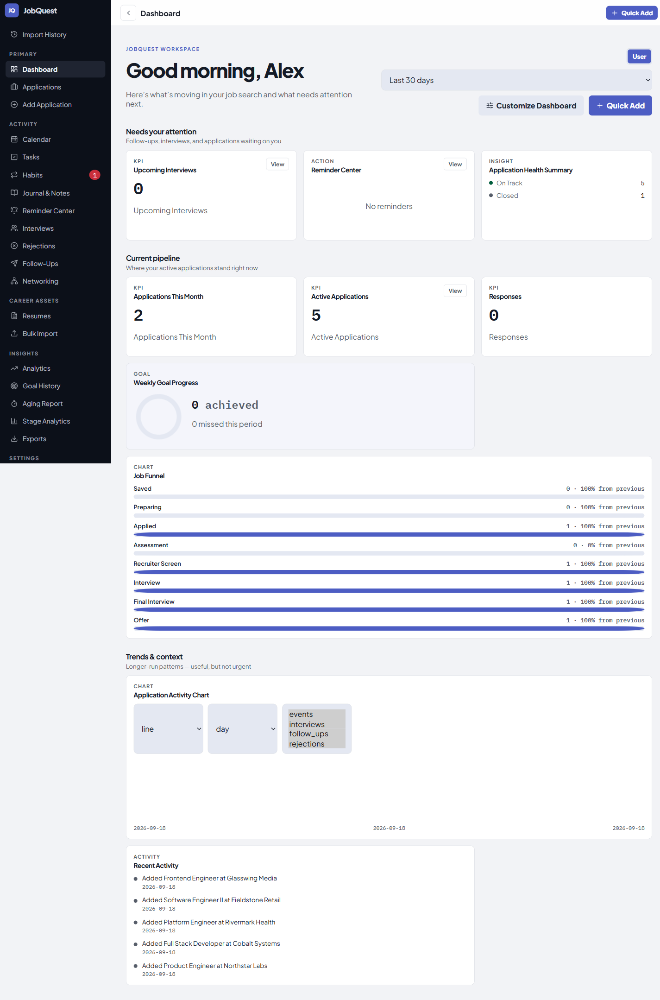

*The three-tier information hierarchy (Needs Your Attention / Current Pipeline / Trends & Context) added in Round 3, with real pipeline data.*


*The same dashboard in the app's light theme — the app is dark-themed by default, with a light override.*

### Applications

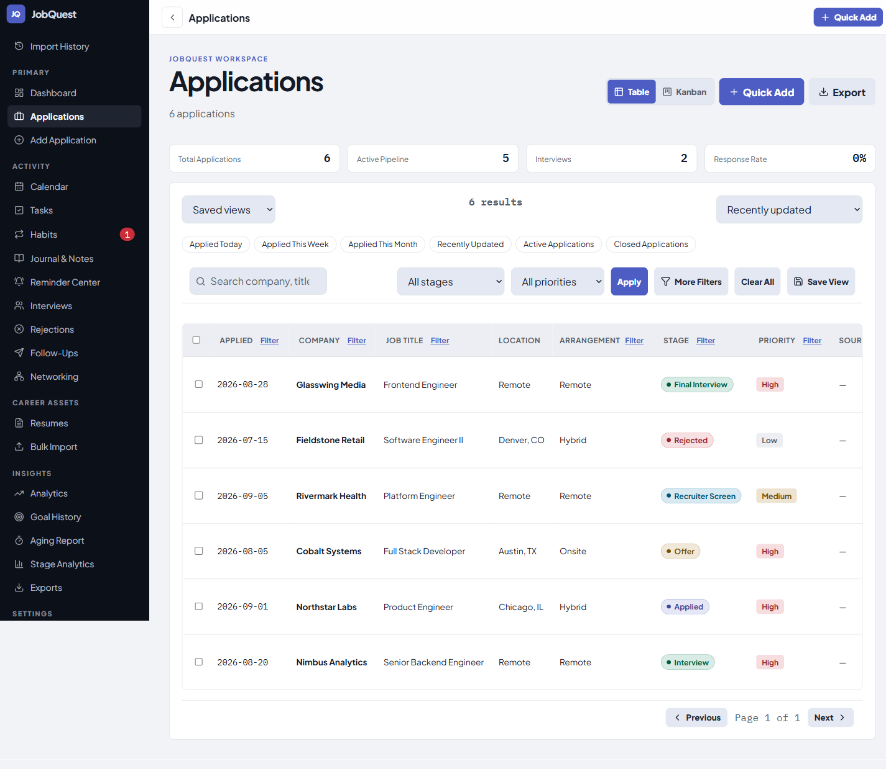

*Table view: quick filters, per-column filter dialogs, saved views, sortable columns.*

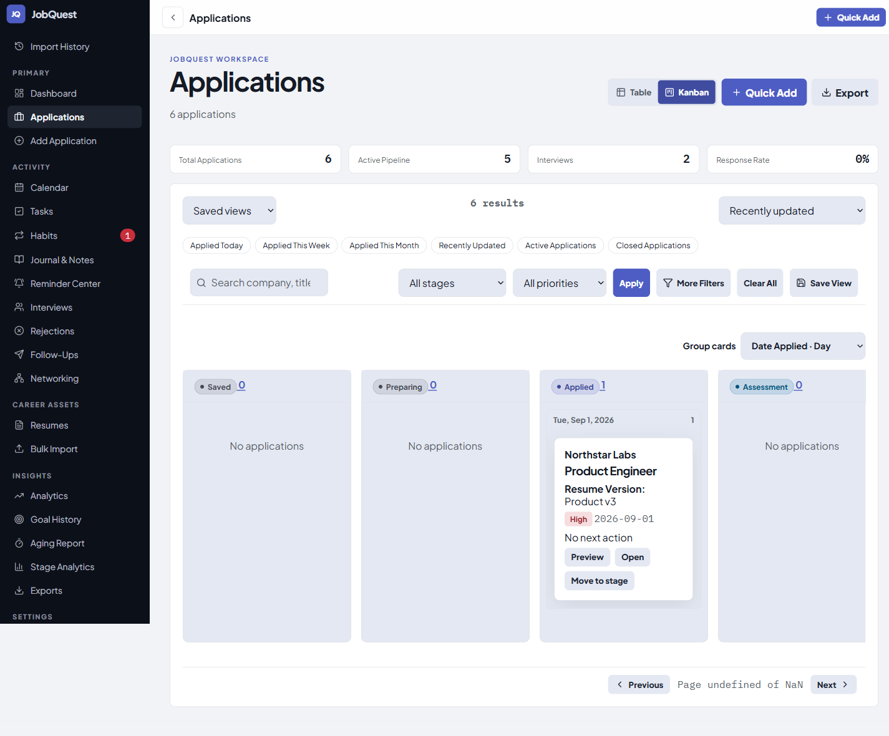

*Kanban view, grouped by stage, with per-card next-action and priority.*

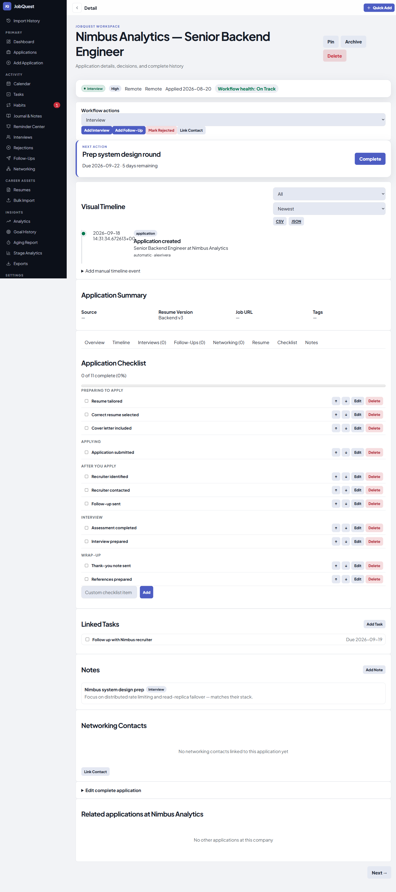

*The Round 4 checklist gap-close: full CRUD, reorder, and lifecycle-phase grouping on an application's detail page.*

### Tasks, Habits, Journal & Notes, Analytics

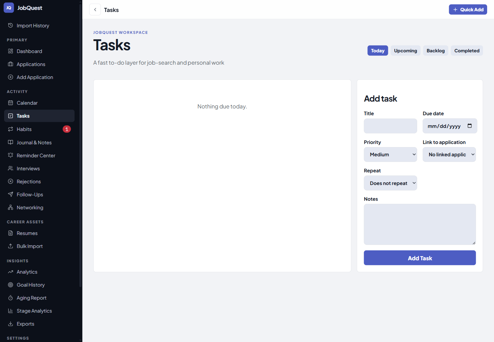

*Round 7's net-new Tasks domain — Backlog/Today/Upcoming/Completed, priority, recurrence.*

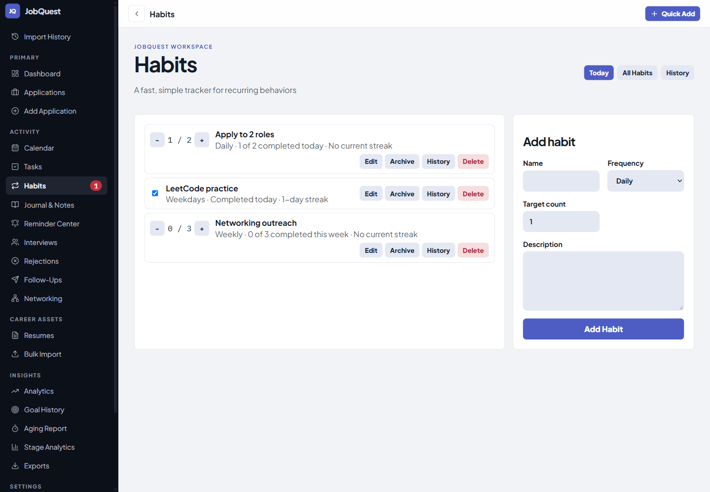

*Round 8's Habit Tracker mid-interaction — a completed daily habit, an in-progress count habit, and a weekly habit.*

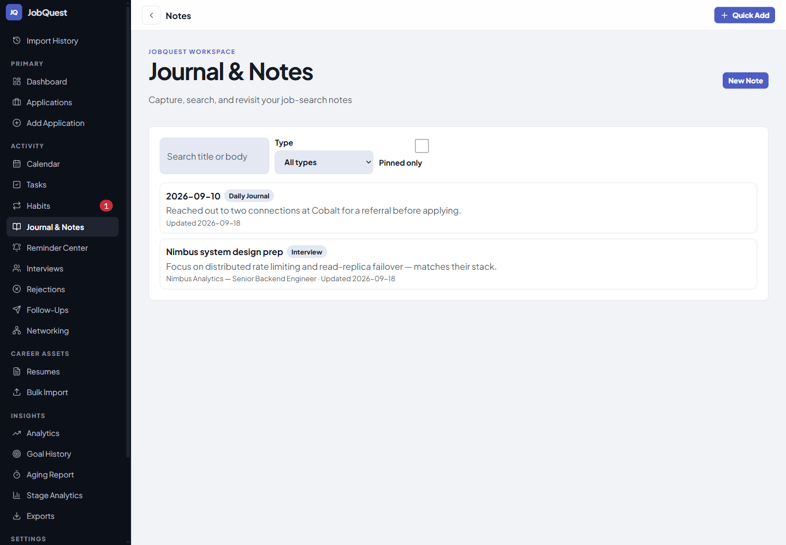

*Round 9's Journal/Notes — a general note linked to an application, and a daily journal entry.*

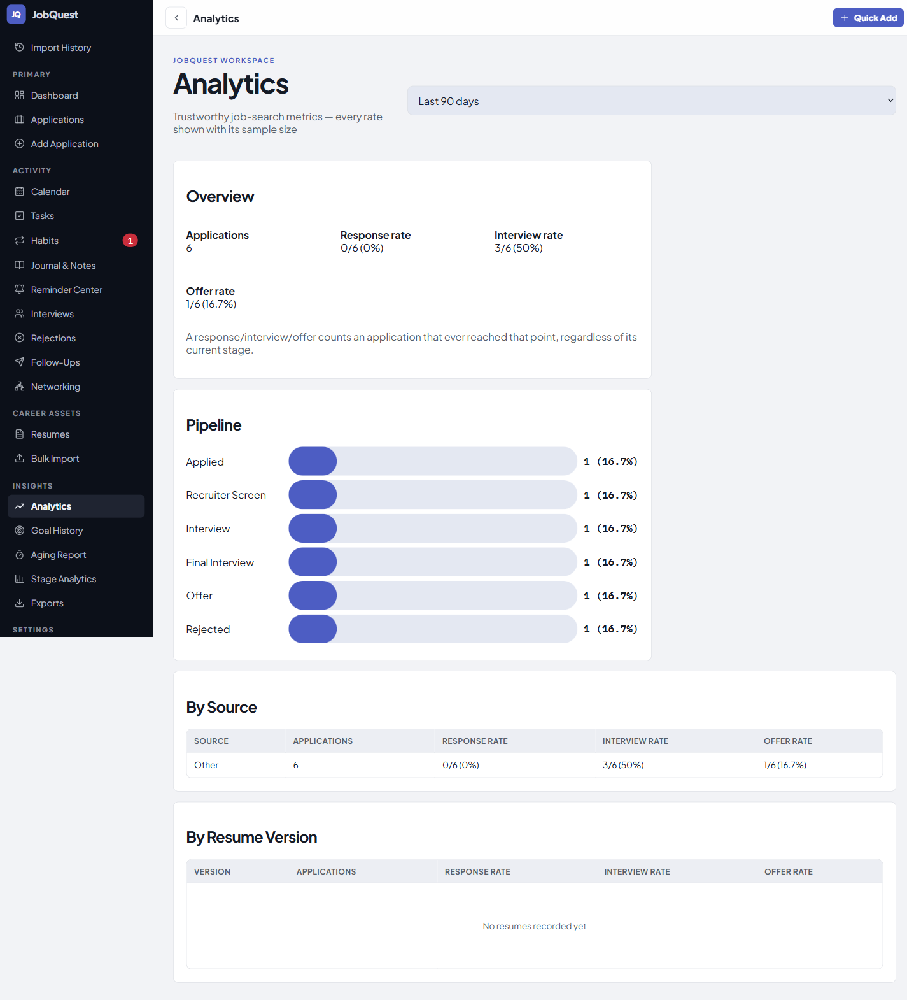

*Round 10's Analytics page — pipeline, by-source, and by-resume-version performance, built on pre-existing backend aggregation.*

### Networking and Import

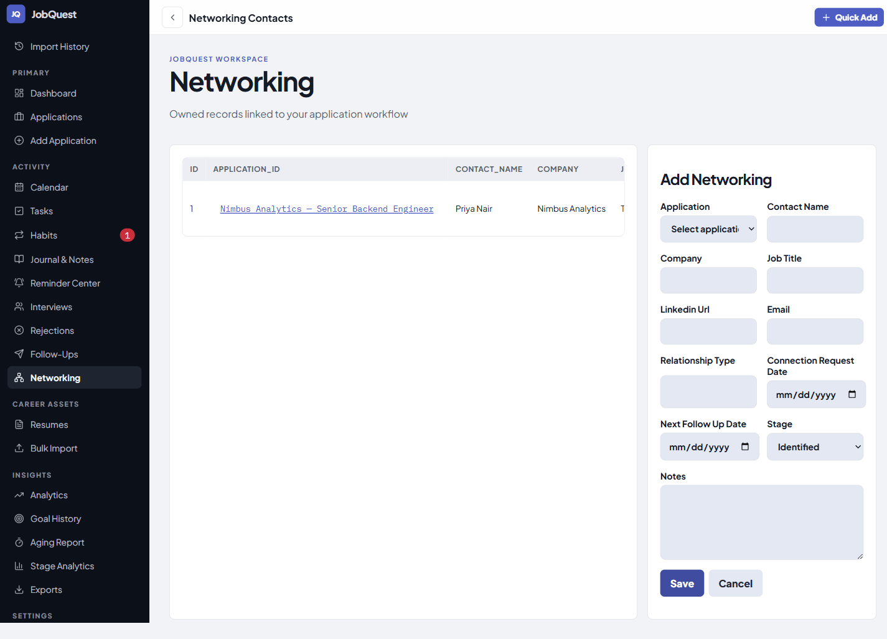

*The Round 5 fix in action: a networking contact genuinely linked to its application.*

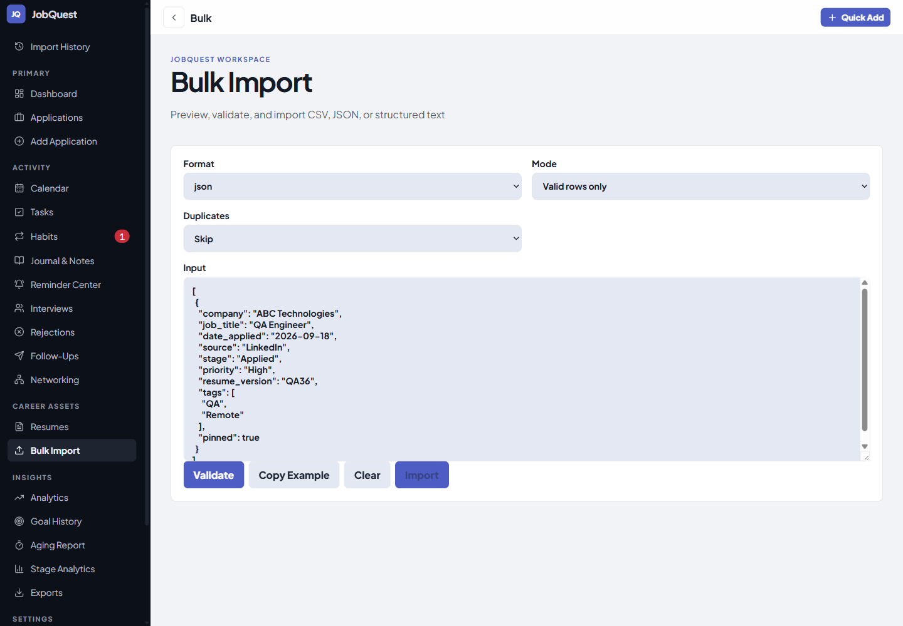

*The Round 6 import workspace, including the new CSV format option.*

### Responsive / mobile

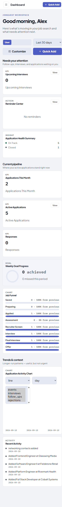
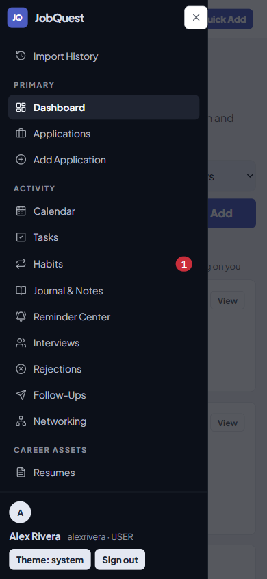
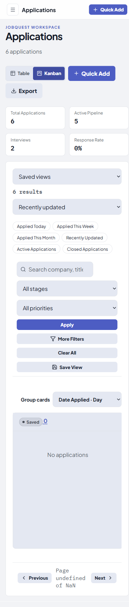

*The same application at 390×844 (the `mobile` viewport project in `playwright.config.js`), including the navigation drawer whose scroll-lock bug was found and fixed during Round 10's final CI validation.*

---

## Portfolio summary

**JobQuest V2** — a ten-round, PR-gated modernization of a production job-application tracker, executed without downtime, without a framework rewrite, and without ever destabilizing a live application's security or deployment posture.

- Extended a hand-rolled Node.js/PostgreSQL backend and a vanilla-JS frontend with six new feature domains (Dashboard revamp, Application Checklist, Contacts/Networking, Import/Export hardening, Task Management, Habit Tracker, Journal/Notes, Analytics) across four new database tables, introduced via forward-only, hand-written SQL migrations.
- Introduced a Vite build pipeline to a previously unbundled frontend with zero observable behavior change, verified by exact-match visual-regression baselines.
- Found and fixed multiple real, pre-existing security and accessibility defects along the way, including a CSV formula-injection hole present in every export and a shared, every-page color-contrast violation — each root-caused to its actual mechanism, not patched around.
- Closed the project with a nine-phase, self-contained final round: a formal security audit, a full accessibility remediation with zero remaining scan exclusions, a performance pass, and a written `development → main` release plan — validated against real PostgreSQL and real Chromium at every stage, including a simulated production-database upgrade before the actual release.
- Made a deliberate, documented decision to **not** rush a fix for a rare, precisely root-caused infrastructure race condition under release pressure — prioritizing it correctly for follow-up work instead of risking a worse bug.

---

## Resume bullets

- Led a 10-round, PR-gated modernization of a production Node.js/PostgreSQL job-application tracker, shipping 6 new feature domains and 4 new database tables via forward-only SQL migrations, with zero downtime and zero breaking changes to the live application's security model.
- Introduced a Vite build pipeline to a previously unbundled vanilla-JS frontend, verified via exact-match Playwright visual-regression baselines to confirm zero observable behavior change — deliberately avoiding a full framework rewrite to protect a working production app.
- Found, root-caused, and fixed a CSV formula-injection vulnerability present across every export endpoint in the application, plus a shared, every-page WCAG color-contrast violation, an unsafe-URL XSS vector, and a mobile navigation race condition that could permanently lock page scroll for real users.
- Designed and ran a formal, 9-phase release-hardening process (security audit with a full cross-domain authorization matrix, accessibility remediation to zero scan exclusions, performance audit, dead-code/refactor pass, full regression suite) before authorizing a production release.
- Diagnosed a rare, intermittent Postgres worker-thread RPC race condition surfacing only under CI load — reproduced it twice independently on different code paths, root-caused it precisely to a missing request-correlation mechanism, and made the deliberate engineering call to document and defer the fix rather than risk a rushed change to synchronous cross-thread database communication code under release pressure.
- Maintained a 5-job GitHub Actions CI pipeline (static analysis, real-Postgres integration tests, security audit, migration validation, real-Chromium visual/accessibility regression) across every round, growing frontend test coverage from 9 to 44 tests and backend integration coverage correspondingly.
- Authored and executed a written `development → main` integration and rollback plan, including a simulated production-database migration upgrade (fresh-install vs. incremental-upgrade parity testing) before the actual release merge.

---

## Interview talking points

**"Tell me about a time you had to push back on requirements."**
Walk through Round 3 (or 5, or 6): the brief assumed the dashboard/filtering system, or the networking-contacts CRUD, or the export pipeline needed to be built from scratch. A direct audit of the existing codebase found most of it already working. The actual engineering contribution was correctly scoping *and documenting* what was really missing — quick filters and a display hierarchy, not a rebuilt dashboard; one broken field wiring, not new CRUD; formula-injection protection, not a new export format. Talk about how re-verifying assumptions against ground truth, repeatedly, was cheaper than either blindly following the brief or blindly trusting your own memory of "how this codebase probably works."

**"Describe a hard architectural decision you made."**
The Tasks-vs-Reminders boundary (Round 7). Two domains looked nearly identical on the surface — full CRUD, priority, due dates, derived state. The deciding factor was a single schema constraint (`reminders.due_date NOT NULL`) that made the "just extend the existing table" option a breaking change to a mature, already-integrated feature. Talk about how you identified that constraint, weighed the two paths, made the call with the stakeholder mid-round, and logged the reasoning so it wouldn't need re-litigating later.

**"Tell me about a bug that was hard to find."**
The `#toast` color-contrast issue. It looked like a straightforward accessibility flag, but the actual colors were provably correct via direct `getComputedStyle` inspection — the real defect was that an `opacity: 0`-only hiding technique left a `role="status"` live region in the accessibility tree at all times, so an automated scanner kept evaluating a component that was visually invisible but not *semantically* hidden. Talk about the discipline of investigating to a specific, falsifiable root cause instead of accepting the first plausible explanation (bad token colors) or the easy workaround (exclude it from the scan) — which is exactly what happened the first time this bug was found, before it was properly fixed a round later.

**"Tell me about a production risk you chose *not* to take."**
The Postgres RPC race condition, found during final release validation. It's real, it's understood, the fix is known — and it was still not patched, because the code in question is a synchronous, cross-thread database communication protocol, and a rushed change to code like that, under release-day time pressure, is a classic way to trade a rare, self-recovering bug for a rare, silent data-correctness bug. Talk about how you evaluated the actual risk (frequency, blast radius, reversibility) versus the risk of the fix itself, and made — and documented — the call to defer it to a properly scoped, unhurried pass instead.

**"How do you approach test flakiness?"**
Several "flaky" CI failures across this project turned out to be real bugs that simply never reproduced locally — a locator ambiguity, a mobile-nav focus race, the Postgres RPC issue. Talk about the standing rule this project applied: every CI failure gets root-caused to a specific mechanism before it's accepted as "flaky," and only after that root cause is understood and evaluated does it get a documented pass/fix/defer decision — never a blind retry.
